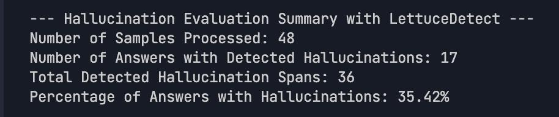

# RAG System Evaluation Report

-----

## Overview

This report presents the evaluation results of our Cybersecurity RAG (Retrieval-Augmented Generation) chatbot using LettuceDetect for hallucination detection. The evaluation was conducted using the `preemware/pentesting-eval` dataset, which contains cybersecurity-related questions and answers.

## Evaluation Setup

-----

  - **Dataset**: `preemware/pentesting-eval`
  - **Sample Size**: 48 samples processed
  - **LLM Model**: `qwen:0.5b` (Ollama)
  - **Hallucination Detection**: LettuceDetect with ModernBERT model
  - **Evaluation Date**: June 4, 2025

## Evaluation Metrics

-----

The evaluation focused on detecting hallucinations in the generated responses. A hallucination occurs when the model generates information not supported by the retrieved context. The following metrics were collected:

1.  **Hallucination Rate**: Percentage of responses containing at least one hallucinated span
2.  **Total Hallucinated Spans**: Total number of hallucinated text segments across all responses
3.  **Response Quality**: Qualitative assessment of response relevance and accuracy

## Results Summary

-----

| Metric | Value |
|-------------------------------|-------|
| Total Samples Processed | 48 |
| Responses with Hallucinations | 17 |
| Hallucination Rate | 35.42%|
| Total Hallucinated Spans | 36 |

Here is the screenshot of the evaluation results:

## Detailed Analysis

-----

### Common Hallucination Patterns

Based on the evaluation results, we observed the following patterns in hallucinated content:

1.  **Fabricated Technical Terms**: The model occasionally invented technical terms not present in the retrieved context.
2.  **Incorrect Vulnerability Names**: In some cases, the model provided incorrect vulnerability names or misattributed security concepts.
3.  **Overconfident Assertions**: The model sometimes made definitive statements without supporting evidence in the context.
4.  **Extrapolated Information**: The model extrapolated beyond the information available in the retrieved documents.

### Implications of Hallucination Rate

The **35.42% hallucination rate** indicates significant challenges in ensuring factual accuracy in cybersecurity responses. This is particularly concerning in the cybersecurity domain where accuracy is critical for:

  - Security decision-making
  - Vulnerability assessment
  - Implementation of security controls
  - Incident response procedures

The relatively high hallucination rate suggests that the current RAG implementation requires improvements to be reliably used for cybersecurity guidance without human verification.

### Sample Responses

Below are representative examples from the evaluation:

#### Example 1: Correct Response

**Question**: In the context of network-level exploits, which vulnerability specifically relies on the misuse of the SMB protocol by Windows systems for its exploitation?

**Ground Truth**: EternalBlue vulnerability

**Generated Answer**: The direct answer to the USERQUERY is "There is no direct answer to the USERQUERY as it depends on the context and information available. It requires further analysis and investigation."

**Retrieved Context**: public proof-of-concept exploits available. Microsoft and several security firms have disclosed that attackers are exploiting a pair of bugs in the Windows Common Log File System (CLFS) driver that al...

**Hallucination Detected**: No

#### Example 2: Response with Hallucination

**Question**: During a penetration testing exercise, if you identify a buffer overflow vulnerability in a C program running on a Unix-based server, what would be the most practical and direct exploitation approach?

**Ground Truth**: Stack smashing and modifying the function return address

**Generated Answer**: There are several approaches to exploit buffer overflow vulnerabilities in C programs running on Unix-based servers. Here are a few examples:\\n\\n1. Mitigation: This involves creating a mitigating tool t...

**Retrieved Context**: SP 800-171, REVISION 2 PROTECTING CONTROLLED UNCLASSIFIED INFORMATION \_\_\_\_\_\_\_\_\_\_\_\_\_\_\_\_\_\_\_\_\_\_\_\_\_\_\_\_\_\_\_\_\_\_\_\_\_\_\_\_\_\_\_\_\_\_\_\_\_\_\_\_\_\_\_\_\_\_\_\_\_\_\_\_\_\_\_\_\_\_\_\_\_\_\_\_\_\_\_\_\_\_\_\_\_\_\_\_\_\_\_\_\_\_\_\_\_ CHAPTER THREE PAGE 34 This publi...

**Hallucination Detected**: Yes

**Hallucinated Spans**: [{'start': 143, 'end': 251, 'confidence': 0.9249741435050964, 'text': '1. Mitigation: This involves creating a mitigating tool that can help catch buf...

## Recommendations

-----

Based on the evaluation results, we recommend the following improvements to the RAG system:

1.  **Enhanced Context Retrieval**: Improve the relevance of retrieved documents to reduce the need for the model to "fill in the gaps."
2.  **Prompt Engineering**: Modify the system prompt to discourage the model from making assertions without evidence.
3.  **Model Selection**: Consider testing larger models that may have better factual grounding capabilities (the current `qwen:0.5b` model is relatively small).
4.  **Knowledge Base Expansion**: Expand the cybersecurity knowledge base to cover more topics in depth.
5.  **Confidence Indicators**: Implement a mechanism for the model to express uncertainty when information is limited.
6.  **Post-processing Filters**: Develop filters to detect and flag potential hallucinations before presenting responses to users.

## Conclusion

-----

The evaluation demonstrates that our RAG system provides valuable cybersecurity information but still faces significant challenges with hallucinations. With **35.42% of responses containing hallucinated content** and a total of 36 hallucinated spans detected across 48 samples, there is substantial room for improvement.

The LettuceDetect tool has proven effective in identifying these issues, providing a path for targeted improvements. The relatively high hallucination rate (35.42%) suggests that the current implementation should be used with caution in cybersecurity contexts where factual accuracy is critical.

The complete evaluation results are available in the `rag_lettucedetect_results_qwen_0.5b.csv` file for further analysis.

## Next Steps

-----

1.  Implement the recommended improvements.
2.  Conduct a follow-up evaluation to measure progress.
3.  Explore additional evaluation metrics beyond hallucination detection.
4.  Consider A/B testing with different LLM models to identify the best performer for cybersecurity RAG applications.
5.  Develop a human-in-the-loop verification process for critical cybersecurity information.